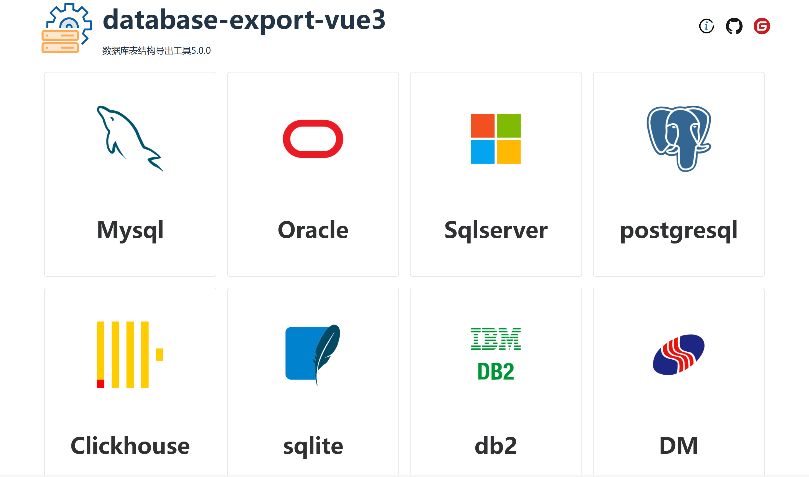
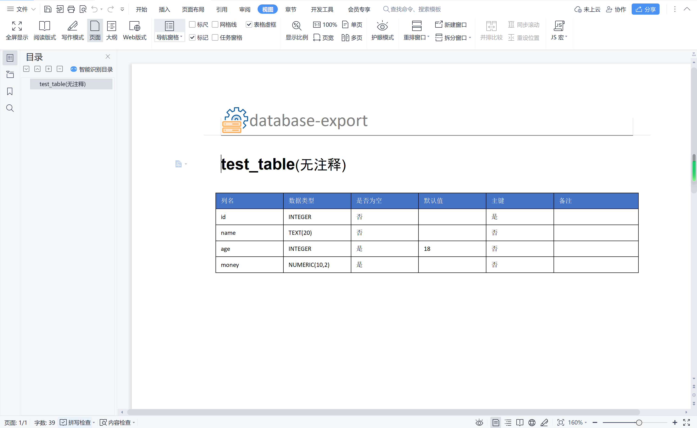

**[转到Gitee](https://gitee.com/pomz/database-export)**

**[转到Github](https://github.com/PomZWJ/database-export)**


**database-export V5.0.0**
=========================


database-export是一款多线程生成数据库结构文档的开源springboot工程，能支持最新的数据库版本，支持导出多种格式的文件，也能直接在网页上预览


现已支持的数据库
------------
* MySQL
* ORACLE
* SqlServer
* Postgresql
* Clickhouse
* Sqlite3
* DB2
* 达梦


现已支持导出的类型
------------
* word
* markdown
* pdf
* html

项目特点
------------

* 导出sql支持多线程查询，导出速度更快
* 使用element-ui-plus，界面更美观
* 支持导出word、markdown、pdf、html，更支持网页预览
* 导出速度高于现在的所有导出工具

想加入技术开发群的加我，备注加群即可(定制模板请备注定制模板)
----------


支持一下我
----------


How to use
------------


#### 1.docker运行(推荐)

```shell
docker pull pomzwj/database-export:5.0.0
```

```shell
docker run -d --name database-export -p 9999:9999 pomzwj/database-export:5.0.0
```


#### 2.下载release下的最新打包的压缩包


cmd/shell执行java -jar xxx.jar 即可启动


#### 3.下载最新的源码启动

------------

**源码运行方法**
>执行database-export-web下的DatabaseExportApplication.java即可,然后浏览器输入:http://localhost:9999

如果想修改前端，前端项目在 

vue2(database-export < 5.0.0)

https://github.com/PomZWJ/database-export-vue

vue3(database-export >= 5.0.0)

https://github.com/PomZWJ/database-export-web-vue3

* 1.前端打包后，会出现dist文件夹，把index.html,logo.png,vite.svg替换到database-export\src\main\resources\templates文件夹

* 2.database-export\src\main\resources\static\static文件夹删除(一定要先删除)，然后在把dist中的assets文件夹复制过来

* 3.重启工程即可生效


#### 4.用户自行开发

> 参考模块[database-export-core-demo]

在pom.xml文件中引入

```xml

<dependency>
    <groupId>io.github.pomzwj</groupId>
    <artifactId>database-export-core</artifactId>
    <version>5.0.0</version>
</dependency>

```
JAVA代码中的使用

```java
protected static DataSource getDataSource() {
    //自行定义数据源
}
public static void main(String[] args){
    DataSource dataSource = getMySqlDataSource();
    try {
        DataBaseExportExecute.executeFile(dataSource, new DbExportConfig()
                .setSearchIndex(true)
                .setExportFileTypeEnum(ExportFileType.WORD)
                //详情见DataBaseType,以下的为字段名,自定字段名导出
                //表字段
                .setShowColumnList(Lists.newArrayList("columnName","dataType","autoIncrement"))
                //索引字段
                .setShowIndexList(Lists.newArrayList("name","seqIndex"))
                .setGenerationFileTempDir("生成文件的位置"));
    }catch (Exception e){
        e.printStackTrace();
    }finally {
        if (dataSource != null) {
            ((DruidDataSource) dataSource).close();
        }
    }
}
```


## 首页截图




## 操作页面截图


## html预览页面截图


## word页面截图




## 更新日志

**2024-06-16(V5.0.0)**

>1.从vue2升级到vue3

>2.element-ui 升级 element-ui-plus

>3.UI改版

>4.后台JAVA架构改造，改造成可以用户使用的第三方SDK，供用户自行开发

>5.修复已知BUG

**2023-12-14(V4.1.0)**

>1.封装docker镜像

>2.导出可以选择表导出

>3.修复已知bug


**2023-05-21(V4.0.0)**

>1.前端工程单独开发,不再使用之前thymeleaf引入vue.js的做法

>2.新增支持DB2和达梦数据库

>3.新增导出支持pdf,html


**2022-10-29(V3.4.0)**

>1.新增支持Sqlite

>2.导出支持Markdown

**2022-10-27(V3.3.0)**

>1.新增支持ClickHouse

>2.修复已知bug

**2022-03-27(V3.2.0)**

>1.支持Postgresql

>2.修复已知BUG


**2021-12-16(V3.1.0)**

>1.数据库连接池改成工厂模式，引入了druid和hikaricp两种连接池，可在yml自定义配置

>2.前端html预览美化，加入了导航

>3.修复已知BUG


**2021-06-27(V3.0.0)**

>1.查询数据库的时候加入了多线程查询,使得导出速度更快

>2.抛弃了之前使用的原生JDBC连接,引入了druid和JdbcTemplate

>3.支持导出excel

>4.支持前端html预览

**2021-06-05(V2.2.0)**

>1.改变java设计模式为工厂模式，方便用户自己扩展

>2.优化了后台代码,尽量把代码实现高度配置化

>3.BUG改进

**2020-07-15(V2.1.0)**

>1.去除了打包后，application需要重新配置模板文件,使部署更简单，不需要在改动到配置文件

>2.去除了自定义文件生成目录

>3.让生成的文件能够下载

>4.BUG改进

**2019-09-26(V2.0.0)**

>1.使用了VUE+Element-UI重新修改了界面，抛弃了原本的Bootstrap

>2.BUG改进

**2019-04-20(V1.0.0)**

>1.使用springboot2.x+Bootstrap完成界面

>2.能导出docx类型的文档,支持mysql,oracle,sql server

----------
- [CSDN](https://blog.csdn.net/huanguta1178/article/details/83690318)
- [submit issue](https://github.com/PomZWJ/database-export/issues/new)

